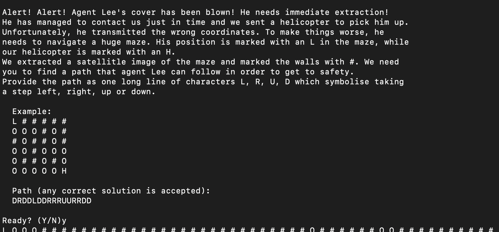

# 4 - Escape Master

**CTF name:** Imperial CTF 22 Qualifiers<br>
**Challenge name:** Escape Master<br>
**Challenge category:** Misc <br>
**Challenge points:** 75 (Easy) <br>

We first connect to the server using `nc 192.168.125.100 9003`
and we are presented with the following message:



We first tried entering a path manually, however there is a time limit of about 1 second which meant that manual solutions were not possible as the maze is 50x50 and randomised each time.

So we created a maze traversal algorithm in Python using BFS, backtracking once we reach the destination to get the string of directions.
We used `pwntools` to connect to the server and do IO.

The maze was initially read as UTF-8 so we had to decode it using `.decode("UTF-8")`

After sending the path to the server using `io.sendline(result)` we get the flag.


```python
from pwn import *

io = connect("192.168.125.100", "9003")

class Coordinate:
  def __init__(self, coordX, coordY):
    self.coordX = coordX
    self.coordY = coordY
    self.parent = None

  def getMovement(self, next):
      if self.coordX + 1 == next.coordX and self.coordY == next.coordY:
        return 'R'
      if self.coordX - 1 == next.coordX and self.coordY == next.coordY:
        return 'L'
      if self.coordX == next.coordX and self.coordY + 1 == next.coordY:
        return 'D'
      if self.coordX == next.coordX and self.coordY - 1 == next.coordY:
        return 'U'

      return '' 

def convert_maze(maze):
    converted_maze = []
    lines = maze.splitlines()
    for line in lines:
        converted_maze.append(line.split())

    return converted_maze


def print_maze(maze):
    for row in maze:
        for item in row:
            print(item, end='')
        print()
        

def is_valid_position(maze, pos_r, pos_c):
  return (pos_r >= 0) and (pos_r < len(maze)) and (pos_c >= 0) and (pos_c < len(maze[0])) and (maze[pos_r][pos_c] in 'OH')

def backtrackPath(cur):
  path = ""
  curr = cur.parent
  prev = cur

  while (curr != None):
    direction = curr.getMovement(prev)
    path = curr.getMovement(prev) + path
    prev = curr
    curr = curr.parent

  return path


def solve_maze(maze):
    stack = []
    start = Coordinate(0, 0)
    stack.append(start)
    while len(stack) > 0:
        pos = stack.pop()
        pos_r = pos.coordY
        pos_c = pos.coordX

        if maze[pos_r][pos_c] == 'H':
            print_maze(maze)
            result = backtrackPath(pos)
            print(result)
            io.sendline(result)
            return True
        if maze[pos_r][pos_c] == 'X':
            continue
        maze[pos_r][pos_c] = 'X'
        if is_valid_position(maze, pos_r - 1, pos_c):
            nextPos = Coordinate(pos_c, pos_r - 1)
            nextPos.parent = pos
            stack.append(nextPos)
        if is_valid_position(maze, pos_r + 1, pos_c):
            nextPos = Coordinate(pos_c, pos_r + 1)
            nextPos.parent = pos
            stack.append(nextPos)
        if is_valid_position(maze, pos_r, pos_c - 1):
            nextPos = Coordinate(pos_c - 1, pos_r)
            nextPos.parent = pos
            stack.append(nextPos)
        if is_valid_position(maze, pos_r, pos_c + 1):
            nextPos = Coordinate(pos_c + 1, pos_r)
            nextPos.parent = pos
            stack.append(nextPos)

        #print_maze(maze)
    return False

print(io.recvuntil("Ready? (Y/N)"))

print(io.sendline("y"))

mazeStr = io.recvuntil("H").decode("UTF-8")
maze = convert_maze(mazeStr)
#maze = convert_maze("L # # # # #\nO O O # O #\n# O # # O #\nO O # O O O\nO # # O # O\nO O O O O H")

print(io.recvuntil("Path:"))

print(solve_maze(maze))

print(io.recvall())
```
